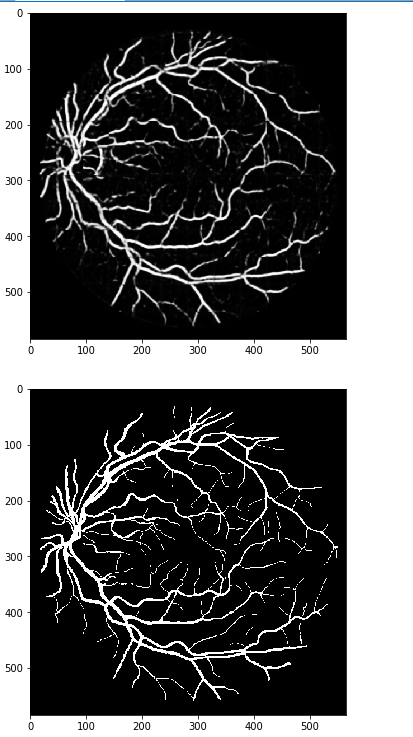

# DRIVE_Segmentation
>Prediction result:

First Row: Ground truths (Ideal outputs we need)

Second Row: Outputs from training 20 epochs

### Evolution Metric is Dice：

Dice（s1,s2）=2*comm(s1,s2)/(leng(s1)+leng(s2))

Where，comm (s1,s2)is s1、s2 the number of the same strings, and leng(s2) is the length of the strings of the s1 and s2.
